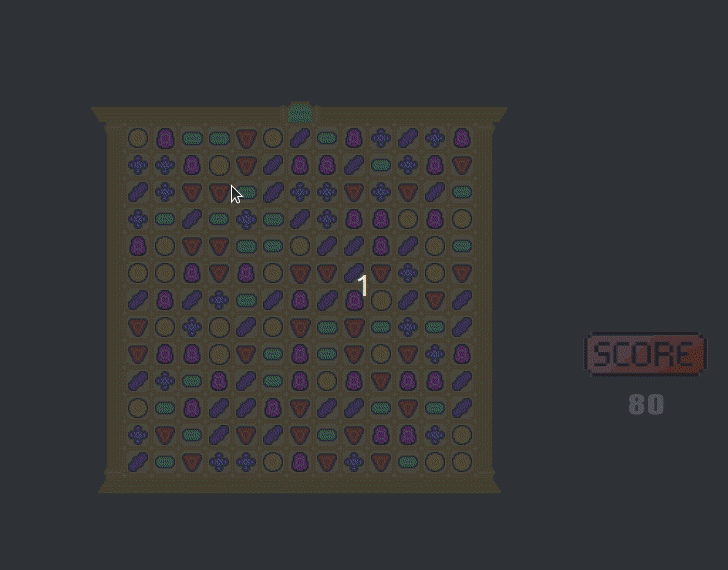

# Jewel (not in terminal :)

Open source puzzle game written in C++ with SFML library.


## Instalation - Linux

1. Download SFML files;

```bash
sudo apt-get install libsfml-dev
```

or

```bash
sudo pacman -S sfml
```

2. Clone repository

```bash
git clone https://github.com/ViktusYT/JewelTerminal.git
```

3. In pch.hpp on line 21 it should be written

```code
#define LINUX
```

4. Compile using make

```bash
make
```

5. Run

```bash
./jewel
```

## Instalation - Windows

1. Download and install [MSYS2](https://www.msys2.org/)
2. Via pacman downlad SFML, mingw64, make

```bash
pacman -S mingw-w64-x86_64-sfml
pacman -S make
pcamna -S git
```

3. Clone repository

```bash
git clone https://github.com/ViktusYT/JewelTerminal.git
```

4. In pch.hpp on line 21 it should be written

```code
#define WINDOWS
```

5. Compile using make

```bash
make
```

6. Run  

```bash
./jewel.exe
```

## License

[MIT](https://github.com/ViktusYT/JewelTerminal/blob/main/LICENSE)
